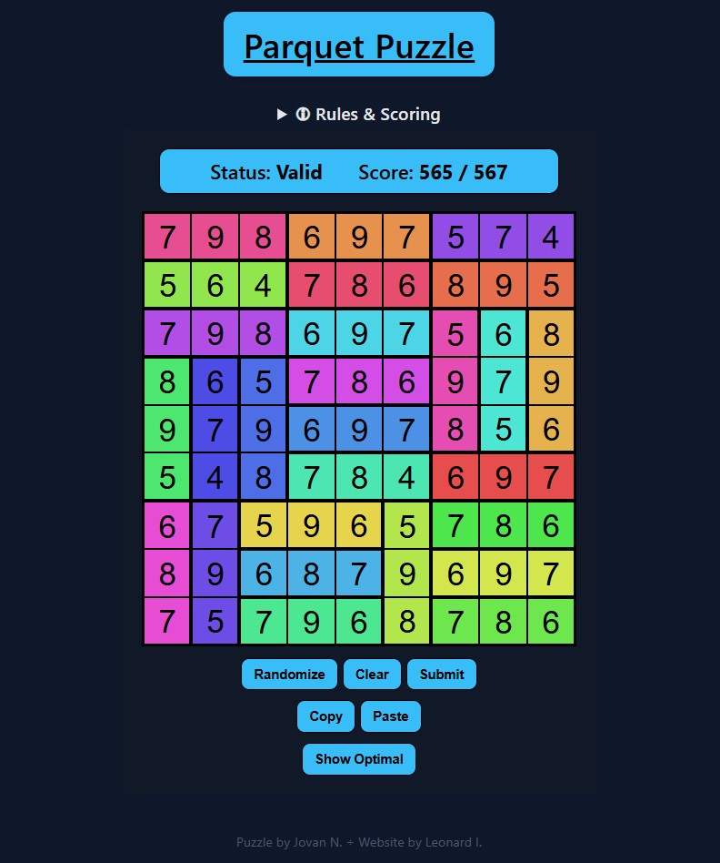

A simple NodeJS / Vue web application for playing logical puzzles.

[Click here to play!](https://parquet-puzzle-1078663927453.europe-west1.run.app/parquet-puzzle)

## Parquet Puzzle

### Rules
Fill the grid with numbers from 1 to 9 so that each colored segment bordered by a thick line contains 3 different numbers. The number in the middle must be the largest. Same digits must not touch anywhere, not even diagonally.

### Screenshot

## Contributing

To get started with development:

1. Clone the repository with `git clone https://github.com/linkret/Parquet-puzzle.git`
1. Make sure you have [Node.js and npm installed](https://docs.npmjs.com/downloading-and-installing-node-js-and-npm).
2. Run `npm install` to install dependencies.
3. Start the development server with `npm run dev`.
4. Open [http://localhost:8080](http://localhost:8080) in your browser.

Feel free to open issues or submit pull requests!
